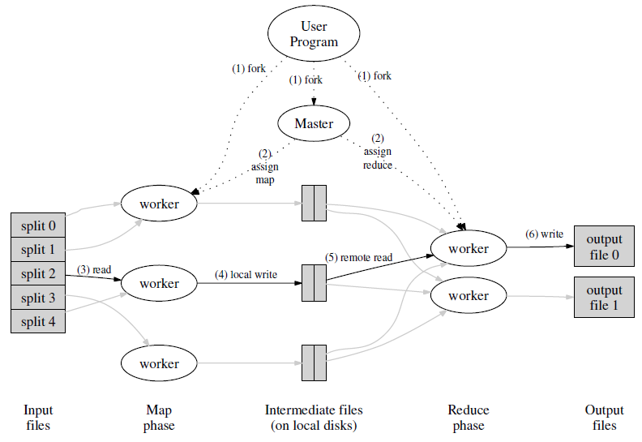

# 0. Reading: MapReduce

## 0.1. Abstraction

MapReduce introduces a programming model and a system designed for processing and generating large datasets. It revolves around two core functions: **map** and **reduce**. The **map** function transforms input key-value pairs into intermediate key-value pairs, while the **reduce** function aggregates all intermediate values associated with a given key. This simple model is flexible enough to express many real-world problems.

```
map    (k1, v1)        ->  list(k2, v2)
reduce (k2, list(v2))  ->  list(v2)
```

One of MapReduce’s key features is its automatic parallelization and execution across a distributed system of commodity hardware. The runtime system handles critical aspects like partitioning input data, scheduling tasks across multiple machines, managing inter-machine communication, and recovering from machine failures. This abstraction enables developers without distributed systems expertise to efficiently leverage the power of large-scale clusters.

<p align="center">
    
</p>

## 0.2. Execution Overview

MapReduce achieves parallel processing by partitioning the input data and intermediate key space into **M splits** and **R partitions**, respectively. The user specifies the number of reduce partitions (R) and the partitioning function (e.g., hash(key) mod R). The framework orchestrates the following steps, as illustrated in Figure above.

#### 1. Input Data Splitting

The MapReduce library divides the input data into **M chunks** (typically 16–64 MB, configurable by the user). Multiple copies of the program are launched across the cluster.

#### 2. Master and Worker Roles

One program copy acts as the **master**, managing task assignment. The remaining programs serve as workers performing either map or reduce tasks. The master assigns **M map tasks** and **R reduce tasks** to idle workers.

#### 3. Map Task Execution

A worker handling a map task:

- Reads the corresponding input split.
- Extracts key/value pairs from the input and processes them using the user-defined Map function.
- Buffers the resulting intermediate key/value pairs in memory.

#### 4. Partitioning and Local Storage

Periodically, buffered intermediate data is written to the local disk. The data is partitioned into **R regions** using the user-specified partitioning function. The master is informed of these storage locations for later use by reduce workers.

#### 5. Intermediate Data Retrieval

Reduce workers, notified by the master, fetch intermediate data from the local disks of map workers using remote procedure calls (RPC). The reduce workers sort the fetched data by keys to group all occurrences of the same key. If the data is too large for memory, external sorting is employed.

#### 6. Reduce Task Execution

Each reduce worker:

- Iterates through sorted intermediate data.
- For each unique key, processes the key and its associated values using the user-defined Reduce function.
- Writes the results to its assigned output file.

#### 7. Completion and Output

After all map and reduce tasks are completed, the master signals the user program, and the MapReduce function returns. The final output consists of R output files (one per reduce task). These files can be used as input for subsequent MapReduce jobs or other distributed applications.

below is the simplified sample code from google's `mrs-mapreduce`

```python
class MapReduce(object):
    ...
    def run(self, job):
        """Default run which creates a map stage and a reduce stage."""
        source = self.input_data(job)
        outdir = self.output_dir()

        try:
            intermediate = self.make_map_data(job, source)
            source.close()
            output = self.make_reduce_data(job, intermediate)
            intermediate.close()
            output.close()

            ready = []
            while not ready:
                ready = job.wait(output, timeout=2.0)
                map_percent = 100 * job.progress(intermediate)
                reduce_percent = 100 * job.progress(output)
                print('Map: %.1f%% complete. Reduce: %.1f%% complete.' % (map_percent, reduce_percent))
                sys.stdout.flush()
        except KeyboardInterrupt:
            print('Interrupted.')
        return 0

class MapOperation(Operation):
    ...
    def map(self, program, input):
        """Yields map output iterating over the entries in input."""
        if self.map_name is None:
            mapper = None
        else:
            mapper = getattr(program, self.map_name)

        if self.combine_name:
            combine_op = ReduceOperation(self.combine_name, self.part_name)
        else:
            combine_op = None

        map_iter = self._map(mapper, input)
        if combine_op:
            # SORT PHASE
            sorted_map_iter = sorted(map_iter, key=itemgetter(0))
            combine_iter = combine_op.reduce(program, sorted_map_iter)
            return combine_iter
        else:
            return map_iter

    def _map(self, mapper, input):
        for inkey, invalue in input:
            for key, value in mapper(inkey, invalue):
                yield (key, value)

class ReduceOperation(Operation):
    ...
    def reduce(self, program, input):
        """Yields reduce output iterating over the entries in input.

        A reducer is an iterator taking a key and an iterator over values for
        that key.  It yields values for that key.
        """
        if self.reduce_name is None:
            reducer = None
        else:
            reducer = getattr(program, self.reduce_name)

        grouped_input = ((k, (pair[1] for pair in v)) for k, v in
            itertools.groupby(input, key=itemgetter(0)))

        for key, iterator in grouped_input:
            for value in reducer(key, iterator):
                yield (key, value)
```

## 0.3. Architectural Behaviors

### 0.3.1 Fault Tolerance
MapReduce ensures resilience against failures, which is critical for large-scale operations involving thousands of machines:

#### Worker Failure
- The **master** pings workers periodically. If a worker fails to respond, it is marked as failed.
- **In-progress tasks** (map or reduce) on failed workers are reset to idle and rescheduled on other workers.
- **Completed map tasks** are also re-executed, as their intermediate output resides on the failed machine's local disk.
- **Completed reduce tasks** do not require re-execution because their output is stored in a global file system.

#### Master Failure
- While periodic checkpoints could allow recovery from a master failure, the current implementation does not support master recovery and aborts the operation. Users can retry the MapReduce job if needed.

#### Semantics in the Presence of Failures
- For **deterministic map and reduce functions**, the output of a distributed MapReduce job is equivalent to a fault-free sequential execution.
- Outputs are written to temporary files and atomically renamed upon completion to ensure consistency.
- In cases of **non-deterministic functions**, outputs of different reduce tasks may reflect different sequential executions, but the results for each reduce task remain consistent.

### 0.3.2 Locality
To conserve **network bandwidth**, MapReduce leverages **data locality**:
- Input data, managed by **Google File System (GFS)**, is stored across multiple machines with replication (typically 3 copies).
- The master schedules **map tasks** on machines with a replica of the required data, or at least on machines near the data (e.g., within the same network switch).
- In large operations involving many workers, most data is read locally, minimizing network usage.

### 0.3.3 Task Granularity
MapReduce divides computation into **M map tasks** and **R reduce tasks**, with several considerations:
- **Fine-grained tasks** (many more tasks than workers) improve:
  - **Load balancing**: Workers can execute many tasks dynamically.
  - **Fault recovery**: Failed tasks are distributed across the cluster.
- Practical limits on M and R:
  - The master must handle **O(M + R)** scheduling decisions and maintain **O(M × R)** state in memory.
  - The memory overhead per map-reduce pair is small (~1 byte).
- Typically:
  - Map task sizes are set between **16–64 MB** to optimize locality.
  - R is set as a small multiple of the expected number of workers.
  - Large-scale jobs often use **M = 200,000** and **R = 5,000** with 2,000 workers.

### 0.3.4 Backup Tasks
To address **stragglers** (slow tasks due to hardware issues, resource contention, or other factors):
- **Backup executions** are scheduled for in-progress tasks when the operation nears completion.
- A task is considered complete once either the primary or backup execution finishes.
- This mechanism slightly increases resource usage (a few percent) but significantly reduces job completion time.
  - Example: Disabling backup tasks increases the runtime of the sort program by **44%**.


# Lecture1. Introduction

## Course Components

### Lectures:
  big ideas, paper discussion, lab guidance
  will be video-taped, available online

### Papers:
  there's a paper assigned for almost every lecture
  research papers, some classic, some new
  problems, ideas, implementation details, evaluation
  please read papers before class!
  each paper has a short question for you to answer
  and we ask you to send us a question you have about the paper
  submit answer and question before start of lecture

### Labs:
  goal: deeper understanding of some important ideas
  goal: experience with distributed programming
  first lab is due a week from Friday
  one per week after that for a while

- Lab 1: distributed big-data framework (MapReduce, as described in the paper)
- Lab 2: fault tolerance library using replication (replication using protocol `Raft` making replicated state machines on many machines)
- Lab 3: a simple fault-tolerant database 
- Lab 4: scalable database performance via sharding (to get performance through replication, we need sharding)


## Main Topics

This is a course about infrastructure for applications.

  - Storage.
  - Communication. 
    - frameworks orchestrating applications
  - Computation. 
    - RPC

To specify the Topics:

### Topic1: Fault Tolerance
  1000s of servers, big network -> always something broken We'd like to hide these failures from the application.
    
- High availability: service continues despite failures. 
  - Replication (If one server crashes, can proceed using the other(s). Labs 2 and 3)
- Recoverability: even if one machine die, we can recover from that.
  - Logging/Transactions to durable storage


### Topic2: Consistency
General-purpose infrastructure needs well-defined behavior.

- E.g. "Get(k) yields the value from the most recent Put(k,v)." 
  - This is consistent in sequential computation. But In concurrent computation, it could not. we'll learn eventual consistency, ...


### Topic3: Performance
The goal: scalable throughput (Labs 1, 4)

Nx servers -> Nx total throughput via parallel CPU, disk, net.

Scaling gets harder as N grows:
- Load imbalance.
- Slowest-of-N latency. (tail latency)
- throughput
- Some things don't speed up with N: initialization, interaction.
  

### Topic4: Tradeoffs (Topics 1~3)
Fault-tolerance, consistency, and performance are enemies.

Fault tolerance and consistency require communication
- e.g., send data to backup
- e.g., check if my data is up-to-date
- communication is often slow and non-scalable
  
Many designs provide only weak consistency, to gain speed.
- e.g. Get() does *not* yield the latest Put()!
- Painful for application programmers but may be a good trade-off.
  
We'll see many design points in the consistency/performance spectrum.

### Topic5: Implementation
  RPC, threads, concurrency control, configuration.
  The labs...


## Map Reduce

Abstract view of a MapReduce job -- word count
```
Map(k, v)
    split v into words
    for each word w
        emit(w, "1")

Reduce(k, v_set)
    emit(len(v_set))
```
```
  Input1 -> Map -> a,1 b,1
  Input2 -> Map ->     b,1
  Input3 -> Map -> a,1     c,1
                    |   |   |
                    |   |   -> Reduce -> c,1
                    |   -----> Reduce -> b,2
                    ---------> Reduce -> a,2
```
1. input is (already) split into M files
2. MR calls Map() for each input file, produces set of k2,v2
   "intermediate" data
   each Map() call is a "task"
3. when Maps are done,
   MR gathers all intermediate v2's for a given k2,
   and passes each key + values to a Reduce call
4. final output is set of <k2,v3> pairs from Reduce()s

\* Sorting, Concatenating things are done by the map reduce library.


### What about fault tolerance?
I.e. what if a worker crashes during a MR job?

We want to hide failures from the application programmer! Does MR have to re-run the whole job from the beginning? Why not?

*MR re-runs just the failed Map()s and Reduce()s.*

Can map run twice? Can reduce run twice? -> yes. if master noticed worker to be dead and it was just temporary network problem, one task would run twice. So MR relies on atomic file system.

Other failures/problems:
  * What if a single worker is very slow -- a "straggler"?
    perhaps due to flakey hardware.
    * coordinator starts a second copy of last few tasks.
  * What if a worker computes incorrect output, due to broken h/w or s/w?
    * too bad! MR assumes "fail-stop" CPUs and software.
  * What if the coordinator crashes?
    * not tolerable. need to re-run all.

<br>
<br>
<br>

# Lecture2. RPC and Threads

Why Go?
  - good support for threads
  - convenient RPC
  - type- and memory- safe
  - garbage-collected (no use after freeing problems)
  - threads + GC is particularly attractive!
  - not too complex

\* [Tour to Go](https://go.dev/tour/welcome/1)

\* [Effective Go](https://golang.org/doc/effective_go.html)

## Threads

Go calls them goroutines; everyone else calls them threads

Threads allow one program to do many things at once. Each thread executes serially, just like an ordinary non-threaded program. The threads share memory. Each thread includes some per-thread state: program counter, registers, stack, what it's waiting for.

### Why threads?
  - I/O concurrency
    - Client sends requests to many servers in parallel and waits for replies.
    Server processes multiple client requests; each request may block.
    While waiting for the disk to read data for client X,
      process a request from client Y.
  - Multicore performance
    - Execute code in parallel on several cores.
  - Convenience
    - In background, once per second, check whether each worker is still alive.

### Threading challenges
- **Race conditions** : what if two threads do n = n + 1 at the same time? or one thread reads while another increments?
  - Avoid sharing data
  - Use locks
  - Race detector
- **Coordination between threads** : one thread is producing data, another thread is consuming it
  - channels
  - confition variables
- **Deadlock** : cycles via locks and/or communication (e.g. RPC or Go channels)

How Go deal with these challenges
1. Channels
   - If you don't need to share memory inter threads
   - For communication
2. Locks + condition variables
   - If you should share memory such as map, set, slice.
   - Sharing state

### Example: vote

Using Locks + condition variables
```go
func main() {
	rand.Seed(time.Now().UnixNano())

	count := 0
	finished := 0
	var mu sync.Mutex
	cond := sync.NewCond(&mu)

	for i := 0; i < 10; i++ {
		go func() {
			vote := requestVote()
			mu.Lock()
			defer mu.Unlock()
			if vote {
				count++
			}
			finished++
			cond.Broadcast()  // non-blocking (even if no one is listening)
		}()
	}

	mu.Lock()
	for count < 5 && finished != 10 {
		cond.Wait()
	}
	if count >= 5 {
		println("received 5+ votes!")
	} else {
		println("lost")
	}
	mu.Unlock()
}
```
Using Channels
```go
func main() {
	rand.Seed(time.Now().UnixNano())

	count := 0
	ch := make(chan bool)  // buffered channel is actually not good
	for i := 0; i < 10; i++ {
		go func() {
			ch <- requestVote()
		}()
	}
	for i := 0; i < 10; i++ {
		v := <-ch  // must clean up same time as you published
		if v {
			count += 1
		}
	}
	if count >= 5 {
		println("received 5+ votes!")
	} else {
		println("lost")
	}
}
```

### Example: Crawler
Concurrent crawler with shared state and Mutex
```go
type fetchState struct {
	mu      sync.Mutex
	fetched map[string]bool
}

func ConcurrentMutex(url string, fetcher Fetcher, f *fetchState) {
	f.mu.Lock()
	already := f.fetched[url]
	f.fetched[url] = true
	f.mu.Unlock()

	if already {
		return
	}

	urls, err := fetcher.Fetch(url)
	if err != nil {
		return
	}
	var done sync.WaitGroup
	for _, u := range urls {
		done.Add(1)
		go func(u string) {
			defer done.Done()
			ConcurrentMutex(u, fetcher, f)
		}(u)
	}
	done.Wait()
	return
}

func makeState() *fetchState {
	f := &fetchState{}
	f.fetched = make(map[string]bool)
	return f
}

func main() {
	ConcurrentMutex("http://golang.org/", fetcher, makeState())
}
```

Concurrent crawler with channels. Organized as MapReduce Lab.

\* Note: there is no recursion here; instead there's a work list.
```go
func worker(url string, ch chan []string, fetcher Fetcher) {
	urls, err := fetcher.Fetch(url)
	if err != nil {
		ch <- []string{}
	} else {
		ch <- urls // since it's not buffered, other threads block.
	}
}

func coordinator(ch chan []string, fetcher Fetcher) {
	n := 1
	fetched := make(map[string]bool)
	for urls := range ch { // a receiver waits until some goroutine sends
		for _, u := range urls {
			if fetched[u] == false {
				fetched[u] = true
				n += 1
				go worker(u, ch, fetcher)
			}
		}
		n -= 1 // worker count (Each worker sends exactly one item on channel.)
		if n == 0 {
			break
		}
	}
}

func ConcurrentChannel(url string, fetcher Fetcher) {
	ch := make(chan []string) // a channel is an object
	go func() {
		ch <- []string{url}
	}()
	coordinator(ch, fetcher)
}

func main() {
	ConcurrentChannel("http://golang.org/", fetcher)
}
```

Worker thread writes url slice, coordinator reads it, is that a race?
  * worker only writes slice *before* sending
  * coordinator only reads slice *after* receiving
  
  So they can't use the slice at the same time.


## RPC

RPC != PC

- a key piece of distributed system machinery; all the labs use RPC
- goal: easy-to-program client/server communication
- hide details of network protocols
- convert data (strings, arrays, maps, &c) to "wire format"
- portability / interoperability

```
RPC message diagram:
  Client             Server
    request--->
       <---response

Software structure
  client app        handler fns
   stub fns         dispatcher
   RPC lib           RPC lib
     net  ------------ net
```
Client:
  - connect()'s Dial() creates a TCP connection to the server
  - get() and put() are client "stubs"
  - Call() asks the RPC library to perform the call
    - you specify server function name, arguments, place to put reply
    - library marshalls args, sends request, waits, unmarshalls reply
    - return value from Call() indicates whether it got a reply
    - usually you'll also have a reply.Err indicating service-level failure
Server:
  - Go requires server to declare an object with methods as RPC handlers
  - Server then registers that object with the RPC library
  - Server accepts TCP connections, gives them to RPC library
  - The RPC library
    - reads each request
    - creates a new goroutine for this request
    - unmarshalls request
    - looks up the named object (in table create by Register())
    - calls the object's named method (dispatch)
    - marshalls reply
    - writes reply on TCP connection
  - The server's Get() and Put() handlers
    - Must lock, since RPC library creates a new goroutine for each request
    - read args; modify reply

### RPC Semantics under Failure

- At-least-once (Best Effort): Try until it succeed. OK for operations that do nothing if repeated like read-only operations. 
- At-most-once: No more than once (0 or 1) <- most cases
- Exactly-once: Only once. 

