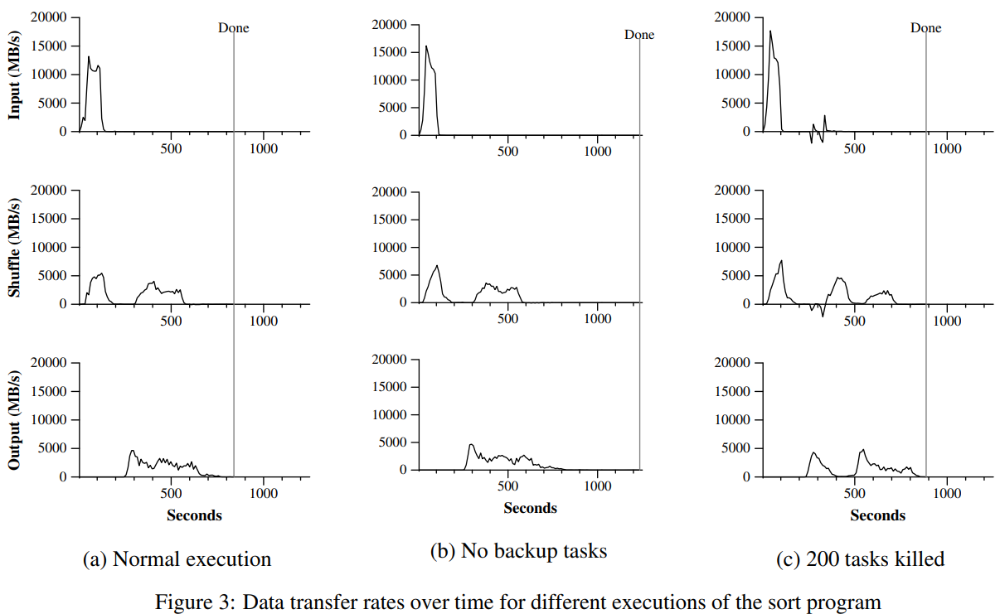
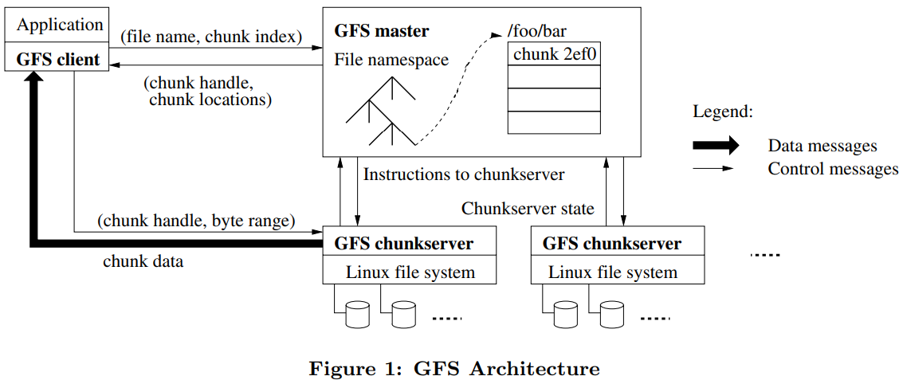
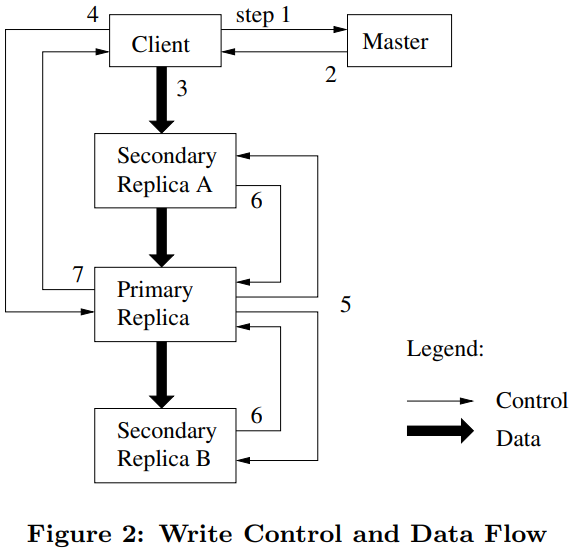
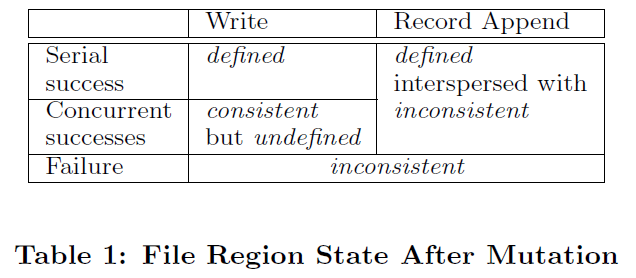

# 0. Reading: GFS

## 0.1. Abstraction

The **Google File System (GFS)** is a scalable, distributed file system designed to support Google’s data-intensive applications while running on inexpensive, commodity hardware. GFS prioritizes **fault tolerance, high availability, and performance** to serve a large number of concurrent clients efficiently. While it shares similarities with traditional distributed file systems, its design is fundamentally shaped by the unique characteristics of Google's workload, leading to several key deviations from conventional assumptions.

1. **Frequent Component Failures** – GFS operates on thousands of machines with commodity hardware, making failures inevitable. The system must incorporate **robust fault tolerance and automatic recovery mechanisms**.
2. **Large File Sizes** – The system is optimized for **multi-gigabyte to terabyte-scale** files rather than numerous small files. This influences decisions on **block size, I/O operations, and system efficiency**.
3. **Append-Heavy Workloads** – Most files are **mutated by appending new data**, rather than being randomly modified. As a result, GFS **optimizes appends for performance and atomicity** while minimizing the need for traditional caching.
4. **Application-Specific API Design** – Unlike generic file systems, GFS is **co-designed with Google’s applications**, allowing it to **relax consistency guarantees** and introduce specialized operations like **atomic record append**. GFS does not provide POSIX API.
5. **Streaming and Random Reads** – Most workloads involve **large sequential reads** (hundreds of KBs to 1MB+ per operation) and **small random reads** (a few KBs). Applications optimize small reads by batching and sorting.
6. **Concurrent Appends by Multiple Clients** – Many applications use files as **producer-consumer queues** with multiple clients appending data. Ensuring **atomicity with minimal synchronization** is critical.
7. **High Throughput over Low Latency** – The system prioritizes **sustained high bandwidth** over low-latency reads/writes, aligning with data processing workloads.

## 0.2. Overview

### 0.2.1. Interface
GFS provides a **hierarchical file system** with common operations like **create, delete, open, close, read, and write**. However, it does not adhere to the **POSIX API**. It introduces two additional operations:
- **Snapshot** – Creates efficient copies of files or directory trees.
- **Record Append** – Allows multiple clients to append data **atomically** without explicit synchronization, useful for distributed processing.

### 0.2.2. Architecture
GFS consists of three main components:
1. **Master Server** – Manages metadata, chunk locations, access control, and system-wide operations. GFS has a **single master server** to **simplify metadata management and optimize chunk placement/replication**.
2. **Chunkservers** – Store file data as fixed-size chunks (default **64MB**), replicated across multiple chunkservers for fault tolerance.
3. **Clients** – Applications that interact with the system. Clients communicate with the **master for metadata** but **directly read/write data from chunkservers** to avoid bottlenecks.

There is **no data caching** at the client or chunkserver level, as most applications process **large streaming files**. (Clients do cache metadata, however.)

### 0.2.3. Chunk Size
Chunks are **64MB**, significantly larger than traditional file system blocks. This provides several advantages:
- **Reduces master interactions** since clients reuse chunk location metadata.
- **Optimizes network efficiency** by keeping persistent TCP connections between clients and chunkservers.
- **Minimizes metadata overhead** in the master, allowing it to store all metadata in memory.

However, large chunks can cause **hotspots** when many clients access the same chunk. GFS mitigates this by **increasing replication** and staggering access patterns.

### 0.2.4. Metadata Management
The master stores three types of metadata **in-memory**:
1. **File and Chunk Namespaces** – Maintains hierarchical file structure.
2. **File-to-Chunk Mapping** – Tracks chunk assignments.
3. **Chunk Locations** – Stored temporarily; retrieved from chunkservers at startup.

#### 0.2.4.1. In-Memory Data Structures
- Keeping metadata in memory makes master operations **fast and efficient**.
- The memory overhead is **low** (~64 bytes per **64MB chunk**), allowing scalability.

#### 0.2.4.2. Chunk Location Management
- The master **does not persistently store chunk locations**. Instead, it queries chunkservers at startup and updates data dynamically.
- This design prevents **synchronization issues** caused by frequent server failures, renames, and reassignments.

#### 0.2.4.3. Operation Log and Checkpointing
- The **operation log** is the only persistent metadata storage, recording all system changes.
- Logs are **replicated across multiple machines** to prevent data loss.
- The master **creates periodic checkpoints** to speed up recovery.
- Recovery involves **loading the last checkpoint** and replaying only recent log entries, ensuring **fast startup**.

### 0.2.5. Consistency

#### 0.2.5.1. What Does Consistency Mean in GFS

GFS does **not** follow strict consistency rules like traditional file systems. Instead, it has a **relaxed consistency model** that ensures high performance and scalability while still providing **useful guarantees** to applications.

What Does Consistency Mean in GFS? Consistency determines **whether all clients see the same data** when reading from different replicas of a file. GFS defines three possible states for a file region after a write operation:
1. **Consistent & Defined** ✅ – All clients see the same data, and it is exactly what was written.
2. **Consistent but Undefined** 🤷 – All clients see the same data, but the content may be a mixture of multiple writes.
3. **Inconsistent (Undefined & Unstable)** ❌ – Different clients may see **different** data.

Example cases:

- **If a write operation succeeds and no other writes happen at the same time**, the file is **consistent and defined**.
- **If multiple clients write to the same file region at the same time**, the file is **consistent but undefined** (the written data may be jumbled together).
- **If a write operation fails**, the file becomes **inconsistent**, meaning different clients may see different data depending on which replica they read from.

GFS avoids **corruption** by ensuring that clients can **detect undefined regions** and by using mechanisms like **chunk version numbers** to avoid stale data.

GFS supports **two types of writes**, each with different consistency guarantees:

##### **(a) Regular Write**
- The client writes data at a **specific file offset**.
- If multiple clients write to the same place at the same time, **data may get mixed up** (undefined but consistent).
- If a write **fails**, different replicas may have **different** data, causing inconsistency.

##### **(b) Record Append (Special GFS Feature)**
- The client requests to **append data to the file**, but **GFS picks the offset**.
- The append is **atomic**—each client’s write will **always** be stored fully at least once.
- However, **GFS may insert gaps or duplicate records** between appends.
- **Used for producer-consumer queues and logs** because multiple clients can append **without conflicts**.


#### 0.2.5.2. Handling Consistency in Applications

Since GFS does **not** guarantee strict consistency, applications must use **simple techniques** to ensure correct results:

1. **Use Appends Instead of Overwrites** 📝  
   - Instead of modifying a file in place, applications **write new data to the end of a file**.
   - Example: A program writes a file completely, then **renames it** when finished to signal that it’s ready.

2. **Use Checkpoints** ✅  
   - Applications periodically **save their progress** so that if a crash happens, they can restart from the last checkpoint.
   - Example: A large computation periodically writes a **"last successfully written position"** so readers know how much data is valid.

3. **Use Self-Validating Records** 🔍  
   - Each record written to GFS includes **extra information** (like checksums or unique IDs).
   - When reading, applications **verify** if a record is correct and ignore invalid or duplicate data.
   - Example: A log file may contain **duplicate entries**, but readers can **filter out duplicates** using unique record IDs.

#### 0.2.5.3. How GFS Handles Failures
- GFS **detects corrupted or lost data** using **checksums** and regular **heartbeat messages** between the master and chunkservers.
- If a chunkserver **fails**, GFS **restores data from other replicas**.
- If **all replicas of a chunk are lost** before recovery, the data is **permanently lost**, but applications will receive a **clear error** instead of incorrect data.

### **Key Takeaways**
✅ **GFS is not fully consistent**, but it ensures that files remain usable.  
✅ **Append operations are atomic**, while regular writes can result in mixed data.  
✅ Applications must handle **duplicate records and checkpoints** to ensure correctness.  
✅ **Data corruption and failures are automatically detected and fixed when possible**.  

## 0.3. System Interaction

### 0.3.1 Leases and Mutation Order

- **A mutation** (write or append) must be applied to **all replicas of a chunk**.
- GFS ensures **all replicas follow the same mutation order** using a **lease mechanism**:
  1. The **master assigns a lease** to one chunkserver, making it the **primary** for that chunk.
  2. The **primary assigns a serial order** to all incoming mutations.
  3. **Secondary replicas** follow this order when applying mutations.
  4. The lease **expires after 60 seconds** but can be extended indefinitely if the chunk is actively written.
  5. If the **primary fails**, the master **waits for lease expiration** before assigning a new primary.

#### **Write Process in GFS**
1. **Client asks the master** for the primary chunkserver and locations of replicas.
2. **Master replies** with this information (client caches it for future use).
3. **Client sends data** to **all replicas** (not yet written to disk, just buffered).
4. **Client sends write request** to the **primary**.
5. **Primary assigns a sequence number**, writes the data, and **forwards the request to secondary replicas**.
6. **Secondaries apply the mutation** in the same order and **send confirmation to the primary**.
7. **Primary confirms** the write was successful and **replies to the client**.

#### **Handling Failures in Writes**
- If **some replicas fail** to apply a write, the region **becomes inconsistent**.
- The **client retries** until the write succeeds across all replicas.
- If a chunk **straddles multiple writes**, it may contain **mixed data from multiple clients** (consistent but undefined state).

### 0.3.2 Data Flow (Efficient Data Transfer)
GFS **separates control flow from data flow** to optimize **network usage**:
- **Control flow** (metadata requests) follows a **client → master → primary → secondaries** path.
- **Data flow** is **pipelined** and follows a **linear chain** among chunkservers.
- **Chunkservers forward data** to the **nearest available replica** to avoid **network congestion**.

#### **Example of Efficient Data Transfer**
1. Client sends data to the **nearest chunkserver (S1)**.
2. **S1 forwards data** to the next closest chunkserver **(S2)**.
3. **S2 forwards data** to the next closest **(S3)**, and so on.
4. **Each chunkserver starts forwarding data immediately** (pipelining) without waiting for full reception.

#### **Advantages**
- **Maximizes bandwidth** – Each machine uses its full **outbound bandwidth**.  
- **Avoids network bottlenecks** – Data moves along **shortest paths**.  
- **Minimizes latency** – **Pipelining** speeds up transfers, allowing **1MB to be distributed in ~80ms**.


### 0.3.3 Atomic Record Append
GFS **supports an atomic append operation** to help applications avoid **race conditions** when many clients write to the same file.

1. **Client sends data to chunk replicas** (same as a normal write).
2. **Primary checks if the data fits in the chunk**:
   - ✅ **If it fits**, the **primary appends the data**, tells secondaries to do the same, and **returns the offset to the client**.
   - ❌ **If the chunk is full**, GFS **pads it to 64MB** and tells the client to retry with a **new chunk**.
3. **If a failure occurs**, the client retries, which may result in **duplicate records**.
4. **GFS does not guarantee bytewise identical replicas**, but ensures **each record is stored at least once**.

#### **Why is Record Append Useful?**
- Helps in **producer-consumer queues** and **log merging**, where multiple clients append to the same file.
- Eliminates the need for **complex distributed locking**.
- Applications handle **duplicates** using **unique record IDs or checksums**.

### 0.3.4 Snapshot (Efficient File Copying)
GFS provides **instant, efficient file snapshots** using a **copy-on-write** strategy.

1. The **master revokes all leases** on the file being snapshotted to prevent modifications.
2. The **master logs the snapshot operation** and **creates a new metadata entry** pointing to the same chunks.
3. When a client **writes to a snapshotted file**, the **first write triggers chunk duplication**:
   - The **master creates a new chunk (C')** on the same chunkservers.
   - The **old chunk (C) is copied locally** (avoiding network transfers).
   - The **client continues writing** to the new chunk (C').

#### **Why Use Snapshots?**
- Allows **fast branching of large datasets**.
- Enables **quick checkpointing** before modifying data.
- Avoids **unnecessary data duplication** until the first write occurs.

### **Key Takeaways**
✅ **Leases ensure writes are applied consistently** across replicas.  
✅ **Decoupling control and data flow** optimizes network usage.  
✅ **Record append allows safe concurrent writes** with minimal overhead.  
✅ **Snapshot enables instant file duplication** without major performance cost.  


## 0.4. Sample Codes

This is code sample from [https://github.com/Gan-Tu/cppGFS2.0.git](https://github.com/Gan-Tu/cppGFS2.0.git)

### 0.4.1. Master

From the code below, we can see that `ChunkServerManager::RegisterChunkServer` registers a new chunkserver by first checking if it is already in the system. If not, it adds the chunkserver to the metadata map and logs its registration. It then creates a lock for the chunkserver to ensure safe concurrent access. The function scans the chunkserver’s stored chunks and updates the `chunk_locations_map_` to reflect which chunks are hosted on this chunkserver. Finally, it adds the chunkserver to a priority list for future chunk allocations and sorts the list based on available disk space. This process ensures that the chunkserver is fully integrated into the system and ready to serve storage operations.

```cpp
bool ChunkServerManager::RegisterChunkServer(
    const std::shared_ptr<protos::ChunkServer> chunk_server) {
  auto result =
      this->chunk_servers_map_.insert({chunk_server->location(), chunk_server});

  // Was successfully inserted, means not previously registered
  if (result.second) {
    LOG(INFO) << "Registering chunk server "
              << CreateChunkServerLocationString(chunk_server->location());

    // Lock guard scope
    {
      // create a lock for this chunkserver
      std::shared_ptr<absl::Mutex> chunk_server_lock(new absl::Mutex());

      // Acquire the newly created lock here exclusively. Ideally, we will be
      // the only one with this lock after inserting it to the lock map, since
      // this chunkserver is just being registered and not yet exposed for
      // allocation.
      absl::WriterMutexLock chunk_server_write_lock_guard(
          chunk_server_lock.get());

      this->chunk_servers_lock_map_.insert(
          {chunk_server->location(), chunk_server_lock});

      // update the chunk location map for the chunks owned by this chunkserver
      // if any.
      for (int i = 0; i < chunk_server->stored_chunk_handles_size(); ++i) {
        this->chunk_locations_map_[chunk_server->stored_chunk_handles(i)]
            .insert(chunk_server->location());
        LOG(INFO) << "Chunk server "
                  << CreateChunkServerLocationString(chunk_server->location())
                  << " reported chunk "
                  << chunk_server->stored_chunk_handles(i);
      }
    }

    // We are about to add this chunkserver to the priority list so it becomes
    // available for allocation. Take a lock since chunk allocation can be going
    // on.
    absl::MutexLock chunk_servers_priority_list_lock_guard(
        &chunk_servers_priority_list_lock_);
    // Now make the chunkserver available for chunk allocation
    this->chunk_servers_priority_list_.push_back(chunk_server);
    // we need to keep ordered
    this->chunk_servers_priority_list_.sort(
        ChunkServerAvailableDiskGreaterCompare());
  }

  return result.second;
}
```

From the code, we can see that `ChunkServerManager::AllocateChunkServer` is responsible for **allocating chunkservers** to store a given chunk while ensuring efficient disk space management and concurrency control. It first checks if the chunk has already been allocated, returning the existing locations if available. If not, it locks the chunkserver priority list (which is sorted by available disk space) and selects servers with the most available storage. Each selected chunkserver is locked individually to update its available disk space and metadata. If allocation is successful, the chunkserver list is re-sorted to maintain ordering, and the new allocations are recorded. This process ensures **optimal storage distribution** while preventing race conditions in concurrent allocations.

```cpp
ChunkServerLocationThreadSafeFlatSet ChunkServerManager::AllocateChunkServer(
    const std::string& chunk_handle, const ushort& requested_servers_count) {
  // Check if we have allocated servers for this previously
  if (this->chunk_locations_map_.contains(chunk_handle)) {
    // Chunk handle has been allocated previously.
    // Return the previously allocated locations.
    LOG(INFO) << "Chunk servers have been previously allocated for chunk: "
              << chunk_handle;
    return this->chunk_locations_map_[chunk_handle];
  }

  ChunkServerLocationThreadSafeFlatSet allocated_locations;

  // Lock due to concurrent allocations. Acquire priority list lock,
  // only one op on priority list at a time.
  // TODO(bmokutub): Consider using read write lock for the priority list to
  // allow doing concurrent (interleaving) allocations. Will take read lock when
  // iterating the list, then drop it. Then take write lock for sorting. But
  // that may delay the allocation until readers release in a highly concurrent
  // situation.
  absl::MutexLock chunk_servers_priority_list_lock_guard(
      &chunk_servers_priority_list_lock_);

  LOG(INFO) << "Allocating chunk servers for chunk: " << chunk_handle;

  ushort allocated_servers_count = 0;
  // Since the list is sorted and servers with max available disk are in front,
  // we just pick them for allocation.
  for (auto iterator = this->chunk_servers_priority_list_.cbegin();
       iterator != this->chunk_servers_priority_list_.cend() &&
       allocated_servers_count < requested_servers_count;
       ++iterator, ++allocated_servers_count) {
    auto chunk_server = *iterator;

    // write lock on the chunkserver since we are updating it
    // It is safe to call location of the chunk_server, since it is never
    // updated during the life time of the chunkserver object. Taking a write
    // lock here, so the available disk doesn't change after our first read and
    // before the update.
    absl::WriterMutexLock chunk_server_write_lock_guard(
        this->chunk_servers_lock_map_[chunk_server->location()].get());

    // Reduce the available disk by chunk size
    // TODO(bmokutub): Use the config manager to get chunk size.
    int32_t new_available_disk = chunk_server->available_disk_mb() - 64;
    // Replace 0 with min_disk_to_maintain
    // TODO(bmokutub): Use the config manager to get min_disk_to_maintain.
    if (new_available_disk <= 0) {
      // stop iterating, won't find any chunk server with larger disk since list
      // is sorted by available disk in descending order
      break;
    }

    allocated_locations.insert(chunk_server->location());

    // Update the chunk server available disk
    chunk_server->set_available_disk_mb(new_available_disk);
    // add this chunk handle to the list of stored chunks
    chunk_server->add_stored_chunk_handles(chunk_handle);

    LOG(INFO) << "Allocated chunk server "
              << CreateChunkServerLocationString(chunk_server->location())
              << " (new available disk= " << new_available_disk << "mb)"
              << " for storing chunk " << chunk_handle;
  }

  if (allocated_servers_count > 0) {
    // We did some allocations and changed some servers availabe disk. Lets
    // reorder them since we always keep the list sorted.
    // We still have the priority list lock here.
    // Worst case this will be O(Nlog(N)), but the assumption here is that since
    // the list is mostly sorted and only requested_servers_count servers are
    // out of place, may be faster most times as long as it is little compared
    // to the number of servers.
    // TODO(bmokutub): Consider doing the sorting asynchronously. Fire a sorting
    // task here, to do it in background. Since this is in the hot path (client
    // request path).
    this->chunk_servers_priority_list_.sort(
        ChunkServerAvailableDiskGreaterCompare());

    // update chunk_handle to location mapping with this info
    this->chunk_locations_map_.insert({chunk_handle, allocated_locations});
  }

  return allocated_locations;
}
```

### 0.4.2. Chunk Server

The `ReadFromChunk` function retrieves the requested chunk version, validates the read offset, and extracts the data, ensuring that the client does not read beyond the chunk’s available content. The `WriteToChunk` function fetches the chunk, validates the write offset to ensure it starts at an existing position or the current end, and enforces the **maximum chunk size limit**. It then modifies the chunk's data in memory and persists the change using LevelDB. These operations align with GFS principles by enforcing **sequential writes, preventing corruption, and ensuring that no writes exceed the allowed chunk size**.

```cpp
google::protobuf::util::StatusOr<std::string> FileChunkManager::ReadFromChunk(
    const std::string& chunk_handle, const uint32_t& read_version,
    const uint32_t& start_offset, const uint32_t& length) {
  auto result = GetFileChunk(chunk_handle, read_version);

  if (!result.ok()) {
    // Read failed
    return result.status();
  }

  auto file_chunk = result.value();

  // Check that we aren't trying to read data that isn't there
  if (start_offset > file_chunk->data().length()) {
    return OutOfRangeError(absl::StrCat(
        "Read start offset is after end of chunk. End of chunk (bytes): ",
        file_chunk->data().length()));
  }

  // This may return less than length, if chunk doesn't have up to that.
  return file_chunk->data().substr(start_offset, length);
}

google::protobuf::util::StatusOr<uint32_t> FileChunkManager::WriteToChunk(
    const std::string& chunk_handle, const uint32_t& write_version,
    const uint32_t& start_offset, const uint32_t& length,
    const std::string& new_data) {
  auto result = GetFileChunk(chunk_handle, write_version);

  if (!result.ok()) {
    // Read failed
    return result.status();
  }

  auto file_chunk = result.value();

  // Update the fetched data

  // Write must start from an existing offset or current end of chunk.
  if (start_offset > file_chunk->data().length()) {
    return OutOfRangeError(absl::StrCat(
        "Write start offset is after end of chunk. End of chunk (bytes): ",
        file_chunk->data().length()));
  }

  // Can write past the current length but not more than max chunk size.
  uint32_t remaining_bytes = this->max_chunk_size_bytes_ - start_offset;

  if (remaining_bytes == 0) {
    // Chunk is full, can't write
    return OutOfRangeError(
        absl::StrCat("Chunk is full. Max chunk size (bytes): ",
                     this->max_chunk_size_bytes_));
  }

  // Don't want to write more than the bytes left for the chunk to be full.
  uint32_t actual_write_length = std::min(length, remaining_bytes);

  // Writes to the same chunk are serialized (no concurrent writes to the same
  // chunk), so no race condition here.

  // write to the existing data in memory
  file_chunk->mutable_data()->replace(
      start_offset, actual_write_length, new_data.data(),
      /*start_position_in_new_data=*/0, actual_write_length);

  leveldb::Status status = WriteFileChunk(chunk_handle, file_chunk.get());

  if (!status.ok()) {
    // write failed
    return UnknownError(
        absl::StrCat("Failed while writing data. Status: ", status.ToString()));
  }

  return actual_write_length;
}
```


# Lecture3. GFS

## Storage Systems

### Why is it hard?

For high performance -> shard data across multiple servers 

-> how about server faults? -> replication for fault tolerance 

-> potential inconsistencies -> strong consistency protocol 

-> lower performance

\* Ideal consistency: Behave as if single system 

## GFS

Is a good case study that it uses replication, fault tolerance, consistency for performance. And it was successful, that it used 1000s servers. But it's not standard in these days. It uses one master, and can have inconsistencies.

Actually, gfs is a filesystem for map-reduce. When the time the paper released, disk technology was about 10~30 MB/s. And it is impressive for nowaday's disks too. 

(image from map reduce paper)

<p align="center">
    
</p>

GFS has these features:

- Big: large data set
- Fast: automatic sharding
- Global: all apps see same file system
- Fault tolerant: automatic fault tolerance


## Design

### What are the steps when client C wants to read a file?

<p align="center">
    
</p>

  1. C sends filename and offset to coordinator (CO, master) (if not cached)
   
     CO has a `filename -> array-of-chunkhandle` table 

     and a `chunkhandle -> list-of-chunkservers` table (with handle version, primary/secondaries, leasetime)

  2. CO finds chunk handle for that offset
  3. CO replies with chunkhandle + list of chunkservers + version number
  4. C caches handle + chunkserver list + version number
  5. C sends request to nearest chunkserver
     with chunk handle + offset
  6. chunk server(S) checks version number if it's not stale and reads from chunk file on disk, returns to client

\* What master handles:
- filename -> array of chunk handles
- chunk handle -> version number(in stable storage), list of chunk servers, primary/secondaries, lease time
- log(in stable storage) + checkpoints(in stable storage) <- so that master can recover using these.

### What about writes? : write as some offset

<p align="center">
    
</p>

1. For each chunk, the master designate one server as "primary". It increases version number of the chunk of the picked primary server.
2. C asks CO(master) about file's chunk at offset
3. CO tells C the primary + secondaries + version number
4. C sends data to all (just temporary...), waits for all replies (Each chunkserver uses LRU buffer cache until the data is used or aged out)
5. C asks P(primary) to write.
6. P checks that lease hasn't expired.
7. P writes its own chunk file (a Linux file).
8. P tells each secondary to write (command: copy temporary into chunk file)
9. P waits for all secondaries to reply, or timeout. Secondary can reply "error" e.g. out of disk space.
10. P tells C "ok" or "error".
11. (After few retries for 3~9) C retries from start if error. (At least once)

Here's how inconsistent content arise:
- Primary P updated its own state.
- But secondary S1 did not update (failed? slow? network problem?).
- Client C1 reads from P; Client C2 reads from S1. => they will see different results

### Consistency : write as some offset



The state of a file region after a data mutation depends on the type of mutation, whether it succeeds or fails, and whether there are concurrent mutations.

If primary tells client that a write succeeded, and no other client is writing the same part of the file(serial), all readers will see the write. -> "defined"

If successful concurrent writes to the same part of a file, and they all succeed, all readers will see the same content, but maybe it will be a mix of the writes. -> "consistent" but "undefined"

    E.g. C1 writes "ab", C2 writes "xy", everyone might see "axyb".

If primary doesn't tell the client that the write succeeded, different readers may see different content, or none. -> "inconsistent"

### Inconsistency Scenario

- There are CO, P, S1, S2 for servers, C1, C2 for clients.
- C1 tries to read chunk. Got #v10 and P, S1, S2 from CO and S2 is the closest. cached.
- C1 reads data from S2.
- Suddenly, CO cannot reach S2.
- C2 writes something to the chunk and now it's #v11 in P, S1.
- C1 tries to read chunk. Since the location and version numbers are cached, reads #v10 from S2.

### Some Questions

What if a primary crashes?
  - Remove that chunkserver from all chunkhandle lists.
  - For each chunk for which it was primary,
        - wait for lease to expire,
        - grant lease to another chunkserver holding that chunk.

What is a lease?
  - Permission to act as primary for a given time (60 seconds).
  - Primary promises to stop acting as primary before lease expires.
  - Coordinator promises not to change primaries until after expiration.
  - Separate lease per actively written chunk.


## How to get stronger consistency

- atomic writes: either all replicas are updated, or none, even if failures.
- read sees latest write.
- all readers see the same content (assuming no writes).


