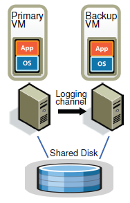
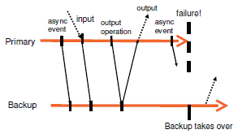

# 0. Reading: The Design of a Practical System for Fault-Tolerant Virtual Machines

## 0.1. Abstract & Introduction

VMware has implemented an enterprise-grade fault-tolerant virtual machine (VM) system using a primary/backup replication approach. The system, integrated into VMware vSphere 4.0, is designed to be user-friendly, operate on commodity servers, and minimize performance overhead to less than 10% for real-world applications. The primary VM is continuously mirrored to a secondary VM on another server with a data bandwidth requirement of under 20 Mbit/s for many applications. This low bandwidth demand enables fault tolerance across longer distances.

Beyond simple VM replication, a commercial fault-tolerant system requires additional components for redundancy restoration after failure. VMware has designed and implemented these elements, addressing practical challenges in enterprise environments. This paper presents the system's design, explores alternative approaches, details implementation aspects, and evaluates performance through benchmarks and real-world applications.

The primary/backup model is a widely used method for ensuring fault tolerance in servers. A backup server remains available to take over if the primary server fails, maintaining an identical state to ensure seamless transition without data loss. One way to maintain this state is by continuously transferring changes in CPU, memory, and I/O device states to the backup. However, this approach can consume significant bandwidth, particularly due to frequent memory modifications.

An alternative is the **state-machine approach**, which treats servers as deterministic state machines that stay synchronized by receiving identical inputs in the same order. While this method significantly reduces bandwidth usage, it requires coordination to manage non-deterministic operations like clock reads and interrupt delivery.

Coordinating deterministic execution in physical servers is complex, but virtual machines provide a more controlled environment. Since a **hypervisor oversees all VM operations, it can capture and replay non-deterministic actions**, ensuring synchronization. This method enables fault tolerance using standard hardware, making it compatible with modern microprocessors and allowing primary and backup VMs to operate across greater physical distances, such as multiple buildings within a campus.

VMware vSphere 4.0 implements fault-tolerant VMs using the primary/backup model. Since it fully virtualizes x86 machines, it supports any x86-based operating system or application without modifications. The core technology, deterministic replay, ensures that the backup VM mirrors the primary VM's execution precisely. VMware Fault Tolerance (FT) extends this by incorporating additional protocols to create a fully functional fault-tolerant system.

The system not only ensures hardware fault tolerance but also restores redundancy by automatically launching a new backup VM if the primary fails. However, current implementations only support uniprocessor VMs, as synchronizing multiprocessor VMs introduces significant complexity due to frequent non-deterministic shared memory accesses.

## 0.2. Basic Fault Tolerance (FT) Design

VMware FT operates by running a backup VM on a separate physical server that mirrors the primary VM’s execution in virtual lockstep. This means the backup VM executes identically to the primary with a slight time lag. The virtual disks are stored on shared storage, such as Fibre Channel or iSCSI disk arrays, ensuring both VMs have consistent access to data.

**Only the primary VM is visible on the network and receives inputs** from external sources, including network packets, keyboard, and mouse inputs. These inputs are transmitted to the backup VM through a dedicated logging channel. This ensures that the backup VM receives the same inputs and executes identically to the primary. To maintain synchronization during non-deterministic operations, additional information is sent to the backup.

If the primary VM fails, the backup seamlessly takes over without disrupting service. A combination of heartbeats and monitoring of the logging channel detects failures. A split-brain scenario, where both VMs continue independently due to network isolation, is prevented by ensuring that only one VM assumes execution.

### Deterministic Replay Implementation

Fault-tolerant VMs rely on deterministic replay, a mechanism that ensures identical execution on the backup VM. Since VMs operate as deterministic state machines, identical inputs produce identical outputs. However, **non-deterministic events** such as virtual interrupts or reading processor timestamps must be handled to maintain synchronization.

VMware's deterministic replay captures all inputs and non-deterministic events, logging them in a structured format. The backup VM replays these logs in real time to ensure identical execution. The event recording mechanism utilizes hardware performance counters in collaboration with AMD and Intel.

Unlike previous approaches that batch events into execution epochs, VMware's system efficiently logs and replays each event at the exact instruction where it occurs. This ensures high fidelity in execution without requiring large-scale batching mechanisms.

### FT Protocol

VMware FT ensures that if a failover occurs, the **backup VM resumes execution in a state fully consistent with the primary’s last externally visible output**. This is enforced by the **Output Rule**, which mandates that the **primary VM must wait for acknowledgment from the backup before transmitting external outputs**.

<p align="center">
    
</p>

The logging channel transmits execution logs to the backup, ensuring that the backup remains synchronized. The primary VM continues execution uninterrupted, but external outputs are delayed until the backup has received all necessary logs. This prevents inconsistencies in failover scenarios.

<p align="center">
    
</p>

### Detecting and Responding to Failure

Failure detection is based on **heartbeat** signals and monitoring logging traffic. If the backup VM detects a failure in the primary, it continues execution using the last received logs and seamlessly assumes the primary role. Similarly, if the backup VM fails, the primary continues running without interruption.

To prevent split-brain scenarios, VMware FT employs a shared storage mechanism. **When a failover occurs, the system uses an atomic test-and-set operation on the shared storage to determine which VM will proceed**. If a VM fails this operation, it halts execution to avoid conflicts.

Once failover occurs, VMware FT automatically starts a new backup VM on an available server, restoring redundancy. This automated redundancy restoration ensures that the system remains fault-tolerant beyond a single failure.


# Lecture4. Primary-Backup Replication

## Failures

- Fail-stop failures (dealt with Primary-Backup)
  - failure = computer stops
  - Type of failures that cause the component of a system experiencing this type of failure stops operating.
  - Cut-off power, network problem, etc.
  - Cannot handle: logic bugs, configuration error(e.g. file incorrect), malicious(e.g. hacking)
  - Maybe handle: primary failure due to earthquake.

## Challenges

- Has primary really failed? 
  - e.g. network failure and primary is still working with client.
  - Split-brain system.
- Keep primary-backup in sync?
  - Apply changes in right order
  - Deal with non-deterministic (make every operations be deterministic)
  - Fail over 
    - what if primary was middle of operation, or was going to send packet to client?
    - what if some machines crash at once?


## Two Approaches

- State transfer
  - client talks to the primary
  - primary makes check point of it's state and sends to the backup

- Replicated state machine (**RSM**)
  - client talks to the primary
  - primary sends the `operation` to the backup
  - Level of operations to replicate
    - application-level operations (file append, write)
    - machine-level(processor level, computer level) operations - vm ft!


## Case Study: Vmware FT

By using exploit virtualization they made replication transparent. Appears to the client that server is a single machine. This is cool because it is VMware product, and can use it nowadays.

### Atomic test-and-set operation on the shared storage

The system uses a network disk server, shared by both primary and backup (the "shared disk" in Figure 1). That network disk server has a "test-and-set service". The test-and-set service maintains a flag that is initially set to false. If the primary or backup thinks the other server is dead, and thus that it should take over by itself, it first sends a test-and-set operation to the disk server. The server executes roughly this code:
```go
  test-and-set() {
    acquire_lock()
    if flag == true:
      release_lock()
      return false
    else:
      flag = true
      release_lock()
      return true
```
The primary (or backup) only takes over ("goes live") if test-and-set returns true.

The higher-level view is that, if the primary and backup lose network contact with each other, we want only one of them to go live. The danger is that, if both are up and the network has failed, both may go live and develop split brain. If only one of the primary or backup can talk to the disk server, then that server alone will go live. But what if both can talk to the disk server? Then the `network disk server acts as a tie-breaker`; test-and-set returns true only to the first call.

### Behave like a single machine

- What if time interrupts, non-deterministic things? 

Since hypervisor controls instructions, it can capture that things. All the sources of randomness are controlled by the hypervisor. For example, the application may use the current time, or a hardware cycle counter, or precise interrupt times as sources of randomness. In all three cases the hypervisor intercepts the the relevant instructions on both primary and backup and ensures they produce the same values.

- What if multi-threading lock? Same winner in the primary must be the winner at the secondary. 
  - FT doesn't cope with multi-processor guests (It's much more complex!)

In general, the results of software running on multiple processors depends on exactly how the instruction streams on the processors were interleaved. For FT to ensure that the backup stays in sync with the primary, it would have to cause the interleaving to be the same on both computers. This turns out to be hard: you can't easily find out what the interleaving is on the primary, and you can't easily control it on either machine.

A more recent VMware product replicates multi-processor guests, probably using a different technique (replicating memory snapshots rather than operations?).

- What is being sent to the backup?....?
  - Linux instructions(inc, dev, ...) are not sent. They just run theirselves.
  - Only some special has to happen at this possible of diversions.
  - Most instructions are deterministic so we don't have to manage it.
  - Non-deterministic things must be handled. e.g. interrupts

- Divergent things
  - Timer interrupts
    - While primary was executing deterministic instruction '100', interrupt arrived. It sends to backup through logging channel with something like `{100, Interrupt, data1}`.
    - After some time, while primary was executing deterministic instruction '200', interrupt arrived. It's sent too. `{200, Interrupt, data2}`.
    - How can backup know where can it be executed? Can it know and wait until instruction 200?
    - Backup just stays behind one message.
  - Non-deterministic(ND)
    - When FT finds that os will run ND command, it runs it and records the result, send to backup like `{ND, result}`.
    - When backup re-executes, since backup's FT has the message, result is the same.
  - Input packets

- Output Rule
  - What if failure were to happen immediately after the primary executed the output operation? (no 'output' logging was sent)
    - client might receive inconsistent result (My explanation: client sends 'inc' to primary, primary 'inc' to it's value, say 10, then becomes 11. And primary tries to send back that to the client. But primary dies, without sending packet arrive/output event. Then client timeout, retries to the backup which is now a new primary. It gets 'inc' command and 'inc' it's value 10, and returns client 11. client actually needed 12, since it tried twice.)
  - Rule: the primary VM may not send an output to the external world, until the backup VM has received and acknowledged the log entry associated with the operation producing the output. (Because of this, bandwidth performance is significantly reduced: Table 2)


