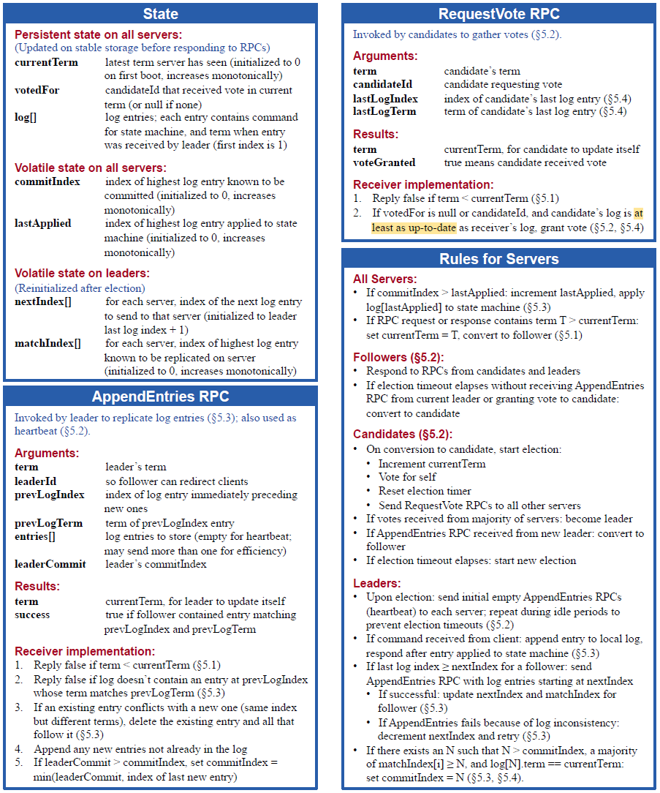
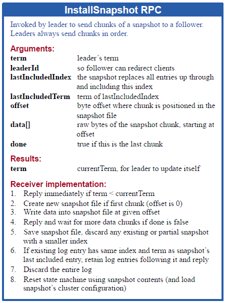

# 0. Reading: Raft

Consensus algorithms allow a collection of machines
to work as a coherent group that can survive the failures
of some of its members. Keeping the replicated log consistent is the job of raft consensus algorithm.

## 0.1. Overview

Raft is a consensus algorithm designed for managing a replicated log in distributed systems. It provides the same functionality and efficiency as Paxos but is structured to be more understandable and easier to implement. The core goal of Raft is to ensure that multiple servers maintain a consistent sequence of log entries, even in the presence of failures.

### 0.1.1. Motivation and Design Philosophy

Consensus algorithms are fundamental for ensuring reliability in distributed systems, allowing a set of machines to function as a unified system that can tolerate failures. While Paxos has been the dominant consensus algorithm, it is known for its complexity, making implementation and comprehension challenging. Raft was designed to be more intuitive by structuring consensus into distinct components: leader election, log replication, and safety. By enforcing stronger consistency constraints and reducing the number of states to consider, Raft simplifies the process of building reliable distributed systems.

### 0.1.2. Replicated State Machines and Log Consistency

Raft operates within the replicated state machine model, where multiple servers maintain identical copies of a state machine. This is achieved by ensuring that each server applies the same sequence of commands in the same order. The consensus algorithm guarantees log consistency across servers, allowing the system to function correctly even when some nodes fail.

Each server maintains a log of commands that are executed in sequence. The consensus mechanism ensures that all logs remain consistent across the cluster. The leader node is responsible for receiving client commands, appending them to its log, and replicating them across other nodes. The system ensures correctness under various failure conditions, including network partitions, delays, and message reordering.

### 0.1.3. Key Properties of Raft

Raft guarantees several critical properties for a reliable consensus algorithm:

- **Safety:** The system never returns an incorrect result, even in the presence of failures.
- **Availability:** As long as a majority of servers are functional and can communicate, the system remains operational.
- **Timing Independence:** Raft does not rely on synchronized clocks for correctness; timing issues may impact availability but not safety.
- **Efficient Commit Process:** A command is committed once a majority of nodes acknowledge it, ensuring minimal delays in normal operation.

### 0.1.4. Core Components of Raft

Raft simplifies consensus by dividing it into three main subproblems:

1. **Leader Election:** When a leader fails, a new leader must be elected. This is done using a randomized timeout mechanism to avoid conflicts and ensure a single leader is chosen efficiently.
   
2. **Log Replication:** The leader receives commands from clients, appends them to its log, and replicates them to follower nodes. Followers ensure their logs remain consistent with the leader’s log, guaranteeing uniformity across the system.

3. **Safety:** Raft ensures that once a log entry is committed, it remains durable and consistent across all nodes. The election mechanism enforces that a newly elected leader must have the latest committed entries before proceeding.

By breaking down consensus into these distinct components, Raft provides a structured and understandable approach to building reliable distributed systems.

## 0.2. Details

    

### 0.2.1. Raft’s Fundamental Properties

Raft ensures five critical safety properties:
1. **Election Safety**: At most one leader is elected per term.
2. **Leader Append-Only**: A leader never overwrites or removes entries in its log; it only appends new ones.
3. **Log Matching**: If two logs contain an entry with the same index and term, then all previous entries in both logs are identical.
4. **Leader Completeness**: Once a log entry is committed in a given term, it will be present in the logs of all future leaders.
5. **State Machine Safety**: If a server applies a log entry to its state machine at a given index, no other server will ever apply a different log entry at that index.

These properties ensure correctness and consistency in a replicated state machine.

### 0.2.2. Raft Basics

A Raft cluster consists of multiple servers (typically five, allowing for up to two failures). Each server operates in one of three states:
- **Follower**: Passive nodes that respond to requests from leaders and candidates.
- **Leader**: The active node that manages client requests and log replication.
- **Candidate**: A node that is trying to become the leader.

Time in Raft is divided into **terms**, each starting with an election. If a leader is elected, it remains in power until the term ends. If no leader is elected due to a split vote, a new term begins with another election.

Raft uses **remote procedure calls (RPCs)** for communication. Two primary RPCs are:
- **RequestVote RPC**: Used by candidates to request votes during leader election.
- **AppendEntries RPC**: Used by leaders to replicate logs and send heartbeats to followers.

### 0.2.3. Leader Election

Leaders are chosen via **randomized election timeouts**. When a follower receives no communication from a leader within a random time (e.g., 150–300ms), it assumes the leader has failed and starts an election. It:
1. Increments its **current term**.
2. Transitions to **candidate** state.
3. Votes for itself.
4. Sends **RequestVote RPCs** to other nodes.

A candidate wins if it receives votes from a majority of nodes. If a split vote occurs, a new election is triggered with new random timeouts to reduce contention.

If a candidate receives an **AppendEntries RPC** from a leader with an equal or higher term, it recognizes the leader and reverts to a follower.

### 0.2.4. Log Replication

Once a leader is elected, it handles **all client requests**. Each request is appended to the leader’s log and replicated across followers using **AppendEntries RPCs**. A log entry is **committed** once a majority of followers acknowledge it. The leader then applies the entry to its state machine and responds to the client.

Raft maintains **log consistency** through the **Log Matching Property**:
- If two logs contain an entry with the same index and term, all previous entries must be identical.
- The leader ensures followers' logs match its own by decrementing their log index until they agree, then overwriting conflicting entries.

The leader never modifies its own log once entries are committed, ensuring **Leader Append-Only**.

### 0.2.5. Safety Mechanisms

To ensure correctness, Raft enforces additional restrictions:
- A new leader must have **all committed log entries** before being elected (**Leader Completeness**).
- A leader **only commits log entries from its current term**; previous-term entries are committed **indirectly** when a new entry is committed.
- If a log entry is committed, it is **guaranteed to be in all future leaders' logs**.

These rules ensure that **all servers apply the same sequence of commands**, preventing divergence.

### 0.2.6. Handling Failures

Raft is designed to handle failures of leaders, followers, and candidates:
- If a leader crashes, a new election is triggered.
- If a follower crashes, the leader continuously retries **AppendEntries RPCs** until the follower recovers.
- If a candidate crashes, it simply restarts the election process when it recovers.
- RPCs are **idempotent**, meaning repeated requests do not cause inconsistencies.

### 0.2.7. Timing and Availability

Raft’s safety does not depend on timing, but **availability** does. For Raft to remain operational:
- **Broadcast time** (time to send an RPC to all nodes) must be **much lower than election timeout**.
- **Election timeout** must be **much lower than mean time between failures (MTBF)**.

Typical values:
- Broadcast time: **0.5ms – 20ms**.
- Election timeout: **10ms – 500ms**.
- MTBF: **Months or more**.

These values ensure rapid leader election and minimal downtime when failures occur.

## 0.2. Additional Functionalities

### 0.2.1. Cluster Membership Changes

Raft supports **dynamic membership changes** to add or remove nodes without disrupting the cluster. A naive approach of switching all nodes to a new configuration at once is unsafe, as it can create two independent majorities. Instead, Raft employs a **two-phase approach** using **joint consensus**:
1. **Transition Phase (Cold,new)**: The leader first commits a joint configuration including both the old and new nodes. During this phase:
   - Log entries are replicated to all nodes in both configurations.
   - Any node from either configuration can be elected leader.
   - Agreement requires separate majorities from both the old and new configurations.
2. **Final Phase (Cnew)**: Once the joint configuration is committed, the leader commits a log entry with only the new configuration. Once this entry is committed, nodes from the old configuration can safely be removed.

To avoid disruptions:
- New servers join as **non-voting members** first to catch up on logs before becoming full participants.
- If the leader is removed in the new configuration, it steps down after committing the new configuration, allowing a new leader to be elected.
- Removed servers can still trigger elections. To prevent disruptions, servers **ignore election requests** if they recently received heartbeats from a valid leader.

This approach ensures that **at no point can two independent majorities make decisions**, maintaining consistency and availability.

### 0.2.2. Log Compaction (Snapshotting)

Raft’s **log grows indefinitely**, which would eventually consume excessive storage and slow down recovery. To prevent this, Raft uses **snapshotting** to periodically discard old log entries while preserving consistency.

1. **Snapshot Creation**:
   - Each server independently takes snapshots of committed log entries.
   - The snapshot includes:
     - **State machine state** (as of the last committed log entry).
     - **Last included index & term** (to maintain consistency in future log entries).
     - **Cluster configuration** at the snapshot point (for membership changes).

2. **Deleting Old Logs**:
   - Once a snapshot is created, log entries up to the last included index are deleted.
   - The snapshot ensures that the **next leader election and log replication remain consistent**.

3. **Leader-Sent Snapshots**:
   - If a **follower is too far behind** (i.e., it requests an entry that the leader has already discarded), the leader **sends a snapshot** via **InstallSnapshot RPC**.
   - The follower discards conflicting logs and applies the snapshot.

4. **Performance Considerations**:
   - Frequent snapshotting wastes disk I/O and CPU, while infrequent snapshotting can lead to large logs.
   - A simple approach is to **snapshot when the log reaches a fixed size**.
   - **Copy-on-write techniques** ensure that snapshot creation does not block normal operations.

Unlike traditional consensus protocols where the leader controls log truncation, Raft allows **independent snapshotting by each follower**, keeping the system **efficient and scalable**.

    

### 0.2.3. Client Interaction & Linearizability

Raft ensures that **clients always communicate with the leader** for both **reads and writes**. To achieve this:
- Clients initially connect to a **random node**. If the node is not the leader, it responds with the latest known leader’s address.
- If the leader crashes, clients **retry their request with another node**.

#### **Ensuring Linearizability**
- If a leader crashes **after committing a command but before responding**, a client might retry, leading to duplicate execution.
- To prevent this, clients **assign unique serial numbers** to each request, and the state machine **tracks the latest processed request for each client**.
- If a duplicate request is received, the state machine **returns the previous response without re-executing**.

#### **Read-Only Requests**
- Reads could return stale data if a leader is **not aware of a more recent term**.
- To ensure correctness:
  1. A leader **commits a blank no-op log entry** at the start of its term to learn the latest committed entries.
  2. Before responding to a read, the leader **must confirm it is still in power** by exchanging heartbeats with a majority of the cluster.

Alternatively, a leader could use **leases** (heartbeat-based timing guarantees), but this would make correctness **dependent on clock synchronization**, which Raft aims to avoid.

### Summary

Raft extends beyond basic consensus to support **dynamic membership changes**, **log compaction**, and **fault-tolerant client interaction**:
- **Membership changes** use a two-phase approach (joint consensus) to prevent split-brain situations.
- **Snapshotting** prevents logs from growing indefinitely, reducing storage overhead and improving recovery times.
- **Clients interact with the leader**, ensuring **linearizable** operations while preventing duplicate execution.
- **Read consistency** is maintained using leader confirmation techniques.

These enhancements make Raft a **practical and scalable** consensus algorithm suitable for real-world distributed systems.

# Lecture 5

# Lecture 6
