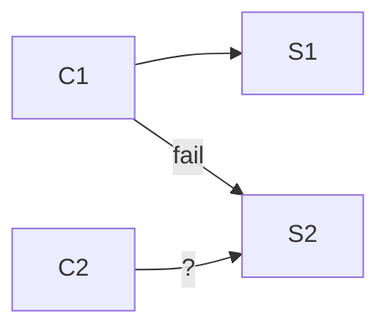
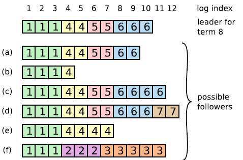

# 0. Reading: Raft

Consensus algorithms allow a collection of machines
to work as a coherent group that can survive the failures
of some of its members. Keeping the replicated log consistent is the job of raft consensus algorithm.

## 0.1. Overview

Raft is a consensus algorithm designed for managing a replicated log in distributed systems. It provides the same functionality and efficiency as Paxos but is structured to be more understandable and easier to implement. The core goal of Raft is to ensure that multiple servers maintain a consistent sequence of log entries, even in the presence of failures.

### 0.1.1. Motivation and Design Philosophy

Consensus algorithms are fundamental for ensuring reliability in distributed systems, allowing a set of machines to function as a unified system that can tolerate failures. While Paxos has been the dominant consensus algorithm, it is known for its complexity, making implementation and comprehension challenging. Raft was designed to be more intuitive by structuring consensus into distinct components: leader election, log replication, and safety. By enforcing stronger consistency constraints and reducing the number of states to consider, Raft simplifies the process of building reliable distributed systems.

### 0.1.2. Replicated State Machines and Log Consistency

Raft operates within the replicated state machine model, where multiple servers maintain identical copies of a state machine. This is achieved by ensuring that each server applies the same sequence of commands in the same order. The consensus algorithm guarantees log consistency across servers, allowing the system to function correctly even when some nodes fail.

Each server maintains a log of commands that are executed in sequence. The consensus mechanism ensures that all logs remain consistent across the cluster. The leader node is responsible for receiving client commands, appending them to its log, and replicating them across other nodes. The system ensures correctness under various failure conditions, including network partitions, delays, and message reordering.

### 0.1.3. Key Properties of Raft

Raft guarantees several critical properties for a reliable consensus algorithm:

- **Safety:** The system never returns an incorrect result, even in the presence of failures.
- **Availability:** As long as a majority of servers are functional and can communicate, the system remains operational.
- **Timing Independence:** Raft does not rely on synchronized clocks for correctness; timing issues may impact availability but not safety.
- **Efficient Commit Process:** A command is committed once a majority of nodes acknowledge it, ensuring minimal delays in normal operation.

### 0.1.4. Core Components of Raft

Raft simplifies consensus by dividing it into three main subproblems:

1. **Leader Election:** When a leader fails, a new leader must be elected. This is done using a randomized timeout mechanism to avoid conflicts and ensure a single leader is chosen efficiently.
   
2. **Log Replication:** The leader receives commands from clients, appends them to its log, and replicates them to follower nodes. Followers ensure their logs remain consistent with the leader’s log, guaranteeing uniformity across the system.

3. **Safety:** Raft ensures that once a log entry is committed, it remains durable and consistent across all nodes. The election mechanism enforces that a newly elected leader must have the latest committed entries before proceeding.

By breaking down consensus into these distinct components, Raft provides a structured and understandable approach to building reliable distributed systems.

## 0.2. Details

<p align="center">
    
</p>

### 0.2.1. Raft’s Fundamental Properties

Raft ensures five critical safety properties:
1. **Election Safety**: At most one leader is elected per term.
2. **Leader Append-Only**: A leader never overwrites or removes entries in its log; it only appends new ones.
3. **Log Matching**: If two logs contain an entry with the same index and term, then all previous entries in both logs are identical.
4. **Leader Completeness**: Once a log entry is committed in a given term, it will be present in the logs of all future leaders.
5. **State Machine Safety**: If a server applies a log entry to its state machine at a given index, no other server will ever apply a different log entry at that index.

These properties ensure correctness and consistency in a replicated state machine.

### 0.2.2. Raft Basics

A Raft cluster consists of multiple servers (typically five, allowing for up to two failures). Each server operates in one of three states:
- **Follower**: Passive nodes that respond to requests from leaders and candidates.
- **Leader**: The active node that manages client requests and log replication.
- **Candidate**: A node that is trying to become the leader.

Time in Raft is divided into **terms**, each starting with an election. If a leader is elected, it remains in power until the term ends. If no leader is elected due to a split vote, a new term begins with another election.

Raft uses **remote procedure calls (RPCs)** for communication. Two primary RPCs are:
- **RequestVote RPC**: Used by candidates to request votes during leader election.
- **AppendEntries RPC**: Used by leaders to replicate logs and send heartbeats to followers.

### 0.2.3. Leader Election

Leaders are chosen via **randomized election timeouts**. When a follower receives no communication from a leader within a random time (e.g., 150–300ms), it assumes the leader has failed and starts an election. It:
1. Increments its **current term**.
2. Transitions to **candidate** state.
3. Votes for itself.
4. Sends **RequestVote RPCs** to other nodes.

A candidate wins if it receives votes from a majority of nodes. If a split vote occurs, a new election is triggered with new random timeouts to reduce contention.

If a candidate receives an **AppendEntries RPC** from a leader with an equal or higher term, it recognizes the leader and reverts to a follower.

### 0.2.4. Log Replication

Once a leader is elected, it handles **all client requests**. Each request is appended to the leader’s log and replicated across followers using **AppendEntries RPCs**. A log entry is **committed** once a majority of followers acknowledge it. The leader then applies the entry to its state machine and responds to the client.

Raft maintains **log consistency** through the **Log Matching Property**:
- If two logs contain an entry with the same index and term, all previous entries must be identical.
- The leader ensures followers' logs match its own by decrementing their log index until they agree, then overwriting conflicting entries.

The leader never modifies its own log once entries are committed, ensuring **Leader Append-Only**.

### 0.2.5. Safety Mechanisms

To ensure correctness, Raft enforces additional restrictions:
- A new leader must have **all committed log entries** before being elected (**Leader Completeness**).
- A leader **only commits log entries from its current term**; previous-term entries are committed **indirectly** when a new entry is committed.
- If a log entry is committed, it is **guaranteed to be in all future leaders' logs**.

These rules ensure that **all servers apply the same sequence of commands**, preventing divergence.

### 0.2.6. Handling Failures

Raft is designed to handle failures of leaders, followers, and candidates:
- If a leader crashes, a new election is triggered.
- If a follower crashes, the leader continuously retries **AppendEntries RPCs** until the follower recovers.
- If a candidate crashes, it simply restarts the election process when it recovers.
- RPCs are **idempotent**, meaning repeated requests do not cause inconsistencies.

### 0.2.7. Timing and Availability

Raft’s safety does not depend on timing, but **availability** does. For Raft to remain operational:
- **Broadcast time** (time to send an RPC to all nodes) must be **much lower than election timeout**.
- **Election timeout** must be **much lower than mean time between failures (MTBF)**.

Typical values:
- Broadcast time: **0.5ms – 20ms**.
- Election timeout: **10ms – 500ms**.
- MTBF: **Months or more**.

These values ensure rapid leader election and minimal downtime when failures occur.

## 0.2. Additional Functionalities

### 0.2.1. Cluster Membership Changes

Raft supports **dynamic membership changes** to add or remove nodes without disrupting the cluster. A naive approach of switching all nodes to a new configuration at once is unsafe, as it can create two independent majorities. Instead, Raft employs a **two-phase approach** using **joint consensus**:
1. **Transition Phase (Cold,new)**: The leader first commits a joint configuration including both the old and new nodes. During this phase:
   - Log entries are replicated to all nodes in both configurations.
   - Any node from either configuration can be elected leader.
   - Agreement requires separate majorities from both the old and new configurations.
2. **Final Phase (Cnew)**: Once the joint configuration is committed, the leader commits a log entry with only the new configuration. Once this entry is committed, nodes from the old configuration can safely be removed.

To avoid disruptions:
- New servers join as **non-voting members** first to catch up on logs before becoming full participants.
- If the leader is removed in the new configuration, it steps down after committing the new configuration, allowing a new leader to be elected.
- Removed servers can still trigger elections. To prevent disruptions, servers **ignore election requests** if they recently received heartbeats from a valid leader.

This approach ensures that **at no point can two independent majorities make decisions**, maintaining consistency and availability.


### 0.2.2. Log Compaction (Snapshotting)

Raft’s **log grows indefinitely**, which would eventually consume excessive storage and slow down recovery. To prevent this, Raft uses **snapshotting** to periodically discard old log entries while preserving consistency.

1. **Snapshot Creation**:
   - Each server independently takes snapshots of committed log entries.
   - The snapshot includes:
     - **State machine state** (as of the last committed log entry).
     - **Last included index & term** (to maintain consistency in future log entries).
     - **Cluster configuration** at the snapshot point (for membership changes).

2. **Deleting Old Logs**:
   - Once a snapshot is created, log entries up to the last included index are deleted.
   - The snapshot ensures that the **next leader election and log replication remain consistent**.

3. **Leader-Sent Snapshots**:
   - If a **follower is too far behind** (i.e., it requests an entry that the leader has already discarded), the leader **sends a snapshot** via **InstallSnapshot RPC**.
   - The follower discards conflicting logs and applies the snapshot.

4. **Performance Considerations**:
   - Frequent snapshotting wastes disk I/O and CPU, while infrequent snapshotting can lead to large logs.
   - A simple approach is to **snapshot when the log reaches a fixed size**.
   - **Copy-on-write techniques** ensure that snapshot creation does not block normal operations.

Unlike traditional consensus protocols where the leader controls log truncation, Raft allows **independent snapshotting by each follower**, keeping the system **efficient and scalable**.

<p align="center">
    
</p>

### 0.2.3. Client Interaction & Linearizability

Raft ensures that **clients always communicate with the leader** for both **reads and writes**. To achieve this:
- Clients initially connect to a **random node**. If the node is not the leader, it responds with the latest known leader’s address.
- If the leader crashes, clients **retry their request with another node**.

#### **Ensuring Linearizability**
- If a leader crashes **after committing a command but before responding**, a client might retry, leading to duplicate execution.
- To prevent this, clients **assign unique serial numbers** to each request, and the state machine **tracks the latest processed request for each client**.
- If a duplicate request is received, the state machine **returns the previous response without re-executing**.

#### **Read-Only Requests**
- Reads could return stale data if a leader is **not aware of a more recent term**.
- To ensure correctness:
  1. A leader **commits a blank no-op log entry** at the start of its term to learn the latest committed entries.
  2. Before responding to a read, the leader **must confirm it is still in power** by exchanging heartbeats with a majority of the cluster.

Alternatively, a leader could use **leases** (heartbeat-based timing guarantees), but this would make correctness **dependent on clock synchronization**, which Raft aims to avoid.

### Summary

Raft extends beyond basic consensus to support **dynamic membership changes**, **log compaction**, and **fault-tolerant client interaction**:
- **Membership changes** use a two-phase approach (joint consensus) to prevent split-brain situations.
- **Snapshotting** prevents logs from growing indefinitely, reducing storage overhead and improving recovery times.
- **Clients interact with the leader**, ensuring **linearizable** operations while preventing duplicate execution.
- **Read consistency** is maintained using leader confirmation techniques.

These enhancements make Raft a **practical and scalable** consensus algorithm suitable for real-world distributed systems.

# 1. Lecture 5

## 1.1. Introduction to consensus algorithm (quorum system)

A pattern in the fault-tolerant systems we've seen so far:
  * MR replicates computation but relies on a single master to organize
  * GFS replicates data but relies on the master to pick primaries
  * VMware FT replicates service but relies on test-and-set to pick primary. All rely on a single entity to make critical decisions
    - nice thing: **decisions by a single entity avoid split brain.** it's easy to make a single entity always agree with itself

How can we make e.g. a fault-tolerant test-and-set service? It's obvious we need replication. How about two servers, S1 and S2? If both are up, S1 is in charge, forwards decisions to S2. If S2 sees S1 is down, S2 takes over as sole test-and-set server. What could go wrong? A failure (or network partition) can make S2 think S1 is down, leading S2 to take over. But if S1 is actually alive, now both S1 and S2 act as leaders (split-brain).

How about letting client to decide which is in charge? Client C1 thinks S1 is in charge, so sends test-and-set to S1 and S2, request to S2 fails. But client cannot know if S2 is down, or network partition happened. Otherwise, Client C2 thinks S2 is in charge and might success since C1 to S2 was network partition. Now what?



The problem here is that computers cannot distinguish "server crashed" from "network broken".
The symptom is the same: no response to a query over the network.
This difficulty seemed insurmountable for a long time.
Seemed to require outside agent (a human) to decide when to switch servers (manual intervention).
We'd prefer an automated scheme!

The big insight for coping w/ partition is majority vote.
```
  Suppose we have an odd number of servers, e.g. 3
  Agreement from a majority is required to do anything -- 2 out of 3 
   - majority is out of all servers, not just out of live ones
  If no majority, wait
  Proceed after acquiring majority
```
Why does majority help **avoid split brain**?
  - **at most one partition can have a majority**
  - breaks the symmetry we saw with just two servers
  - more generally 2f+1 can tolerate f failed servers since the remaining f+1 is a majority of 2f+1
    

Two partition-tolerant replication schemes were invented around 1990,
  Paxos and View-Stamped Replication
  called "consensus" or "agreement" protocols
  in the last 15 years this technology has seen a lot of real-world use
  the Raft paper is a good introduction to modern techniques


## 1.2. Raft Overview: State Machine Replication

Raft implements **state machine replication**, ensuring all servers apply the same operations in the same order.  

### Raft Architecture
Each server consists of:  
- **Key/Value Layer**: Stores actual application state (e.g., a database).  
- **Raft Layer**: Manages consensus using logs.  

### How a Client Command is Processed in Raft
1. **Client sends a command** (e.g., `Put(k, v)`) to the leader.  
2. **Leader adds the command to its log**.  
3. **Leader sends "AppendEntries" RPCs** to followers.  
4. **Followers add the command to their logs**.  
5. **Leader waits for a majority to replicate the command**.  
6. **Once a majority acknowledges, the command is "committed"**.  
7. **Leader applies the command to the state machine and responds to the client**.  

### Why Keep a Log?
- Orders commands for **consistent execution across replicas**.  
- Stores **tentative** commands until a majority commits them.  
- Allows recovery after failures.  
- Ensures followers can catch up if they lag behind.  

### Are Logs Identical Across Servers?
- **Not always**: Some followers may lag behind.  
- **However, they eventually converge**, ensuring only stable commands are executed.  


## 1.3. Leader Election in Raft (Lab 2A)

### Why Elect a Leader?
- Ensures all replicas execute the same commands in the same order.  
- Unlike Paxos (which is leaderless), Raft uses a **single leader** per term.  

### Leader Election Process
1. A **server starts an election** if it doesn’t receive heartbeats from a leader within an **election timeout**.  
2. It increments its **currentTerm** and requests votes from other servers.  
3. A candidate needs **a majority of votes** to become leader.  

**Key Constraints:**  
- A server votes **only once per term**.  
- If a candidate receives a majority, it becomes the leader.  
- If no candidate wins (e.g., votes are split), a **new election starts with a higher term number**.  

### How a Server Learns About a New Leader
- The leader **sends periodic heartbeats** using `AppendEntries` RPCs.  
- If a server sees a higher term in an `AppendEntries` RPC, it steps down.  

## 1.4. How Raft Avoids Split Votes

If multiple candidates start elections at the same time, they may all get one vote each, preventing a majority.  

**Solution: Randomized Election Timeout**  
- Each server **waits a random time** before starting an election.  
- This **breaks symmetry**, making one candidate more likely to win.  
- If a leader is elected quickly, other servers receive heartbeats and do not start elections.  

### Choosing the Election Timeout
- Must be **long enough** to avoid unnecessary elections.  
- Must be **short enough** to detect failures quickly.  
- Lab 2A requires elections to complete **within 5 seconds**.  


## 1.5. Handling Old Leaders and Network Partitions

What happens if an old leader is unaware of the new leader?  
- The new leader has a **higher term number**.  
- If the old leader tries to append new log entries:  
  - Followers will reject them because they see a higher term.  
  - The old leader will **step down**.  
- This prevents **split-brain** but may cause temporary log divergence.  


# 2. Lecture 6

In the previous lecture, we explored Raft's leader election process, ensuring that **each term has at most one leader**. Clients interact exclusively with the leader, ensuring they do not see inconsistencies from follower states or logs. Today, we shift focus to log replication, persistence, and compaction, which are crucial for maintaining consistency and preventing divergence in distributed systems.

## 2.1. Raft Log and Log Divergence (Lab 2B)

A key challenge in log replication is **log divergence**, which occurs when different servers maintain different logs due to leader crashes and elections. Consider a scenario where a leader crashes before propagating an entry to all followers. For example, if S1, S2, and S3 are servers, the logs could look like this:

```
S1: 3
S2: 3 3
S3: 3 3
```

Here, S1 missed an entry due to a crash (of leader S2 or S3), causing a temporary divergence. More dangerously, different logs might have different commands in the same index. If a series of leader crashes occur, logs could end up looking like this:

```
       10 11 12 13  <- Log Index
S1:     3
S2:     3  3  4
S3:     3  3  5
```

This divergence happens when a leader appends an entry, crashes before propagating fully, and a new leader later writes a different command at the same index. If these discrepancies are not resolved correctly, different servers might execute different operations for the same log index, violating **state machine safety**. Raft must ensure that if any server executes a given command, no other server executes a different command at that log index.

To enforce consistency, Raft requires that when a new leader is elected, followers **truncate** any conflicting log entries and adopt the leader’s log. When a new leader (suppose S3 is elected) attempts to append an entry at index 13, it first sends an `AppendEntries` RPC referencing the previous log entry:

```
prevLogIndex=12, prevLogTerm=5
```

If a follower detects a conflict (e.g., a different term at index 12), it rejects the RPC. The leader then decrements `nextIndex` for that follower and retries with an earlier `prevLogIndex`, eventually overwriting conflicting entries. This ensures all followers’ logs match the leader’s log.

```golang
st := args.PrevLogIndex + 1
for i, entry := range args.Entries {
   ...
   if st+i < len(rf.log) &&
      (rf.log[st+i].Term != entry.Term ||
         rf.log[st+i].Command != entry.Command) {
      rf.log = append(rf.log[:st+i], args.Entries[i:]...)
      break
   }
}
```

## 2.2. Ensuring Committed Entries Are Never Lost

One fundamental guarantee in Raft is that **committed entries must never be lost**. A committed entry is one that a leader has successfully replicated to a majority. If a new leader does not contain a previously committed entry, it would be disastrous because clients might have already acted based on that committed state. To prevent this, Raft ensures that a newly elected leader **always contains all committed entries**.

One might assume that electing the server with the longest log would solve this problem, but this approach is flawed. Consider the following scenario:

```
S1: 5 6 7
S2: 5 8
S3: 5 8
```

Here, S1 appears to have the longest log, but S2 and S3 might contain committed entries (e.g., entry 8). If S1 were elected, it might overwrite committed data. To prevent this, Raft’s **election restriction** states that a server will only vote for a candidate whose log is **at least as up-to-date** as its own. This is determined by **comparing the last log term** first, and if equal, **comparing the log length**. In the above case, S2 and S3 will not vote for S1, ensuring that the new leader retains all committed entries.

<p align="center">
    
</p>

Here, suppose top server was the leader for term 8 and just died. Who could become leader?
- a: yes -- a, b, e, f
- b: no -- b, f
- e has same last term, but its log is longer
- c: yes -- a, b, c, e, f
- d: yes -- a, b, c, d, e, f
- e: no -- b, f
- f: no -- f

=> why won't `d` prevent `a` from becoming leader? After all, `d`'s log has higher term than `a`'s log?
=> `a` does not need `d`'s vote in order to get a majority. `a` does not even need to wait for `d`'s vote. `d`'s logs with idx 10, 11, 12 are not committed. So we can discard them.

## 2.3. Persistence and Crash Recovery (Lab 2C)

After a server crash, it must be able to rejoin the cluster without disrupting consistency. Raft persists certain key state variables to stable storage:
- **Log entries** to ensure commands are not lost. so next leader's vote majority includes the entry, so Election Restriction ensures new leader also has the entry.
- **Current term** to avoid outdated leaders.
- **Voted for** to prevent re-voting in the same term.

These variables must be written to **non-volatile storage** before responding to RPCs. Without persistence, a rebooted server might mistakenly vote for multiple candidates in the same term, potentially electing multiple leaders.

Some state variables, like `commitIndex` and `lastApplied`, do not need to be persisted since they can be recomputed from the log. However, persistence is often a **performance bottleneck**. Writing to disk is slow—HDD writes take about 10ms, while SSDs take around 0.1ms—limiting operations per second. To mitigate this, optimizations like **batching** multiple log entries per write and using battery-backed RAM are common.

## 2.4. Log Compaction and Snapshots (Lab 2D)

As a Raft cluster runs, its log grows indefinitely, consuming excessive storage. However, the **executed state** of the system captures all necessary historical data. To address this, Raft periodically creates **snapshots** that store the entire state of the application at a certain point, allowing earlier log entries to be discarded.

Each server creates snapshots independently, storing them persistently. When a server restarts, it loads the snapshot instead of replaying the entire log, drastically reducing recovery time. The leader may also need to send a snapshot to a follower if the follower’s log falls behind and can no longer catch up via `AppendEntries`. In such cases, Raft uses an `InstallSnapshot` RPC to synchronize the follower.

While snapshots are effective for small state machines, they become impractical for large databases. Instead, storing state in an on-disk structure like a B-tree can eliminate the need for explicit snapshots, allowing on-disk updates to serve as implicit snapshots.

## 2.5. Optimizing Read-Only Operations

In traditional Raft, even **read-only operations** like `Get(key)` must be committed in the log to prevent stale reads. Suppose a server incorrectly believes it is the leader and processes a read request. If a new leader exists, its state may be more recent, leading to inconsistent reads (split-brain). To prevent this, Raft forces all `Get` operations to be **committed** before responding, ensuring linearizability.

However, committing read operations increases latency, which is problematic for read-heavy workloads. A common optimization is **leases**, where the leader, upon receiving an `AppendEntries` majority, grants itself a lease for a set duration (e.g., 5 seconds). During this lease period, it can process reads without logging them. If a new leader is elected, followers ensure the previous lease has expired before accepting writes, preventing stale reads.

For the 6.5840 labs, students must commit `Get()` operations in the log, though real-world systems often use leases to optimize performance.

# 3. Lecture 7 (article)

The Go programming language, developed at Google in 2007 and released as open source in 2009, has grown into a foundational tool for cloud infrastructure. Many of the world’s largest cloud platforms, including Docker and Kubernetes, are built using Go. Its success stems not from groundbreaking language features but from its emphasis on engineering efficiency, dependency management, scalable development, and secure-by-default programming. This focus on the broader software development environment, rather than just the syntax or semantics of the language, has made Go a popular choice for building large-scale systems.

## 3.1. Origins and Motivation
Go was created in response to challenges encountered at Google, where thousands of engineers worked on a massive shared codebase in multiple languages (C++, Java, Python). A key issue was the complexity of dependencies—importing one library could trigger the compilation of an entire tree of dependencies, leading to inefficiencies. Additionally, existing multithreading models were cumbersome, making it difficult to fully utilize the growing number of CPU cores in modern systems.

At the production level, Google was running massive distributed systems, processing petabytes of data and handling millions of requests per second. However, traditional concurrency models were inefficient, often requiring multiple copies of the same binary instead of efficient multithreading. Go was designed to simplify and optimize these challenges by introducing lightweight concurrency primitives, an efficient garbage collector, and a streamlined approach to dependency management.

## 3.2. The Go Language and Its Ecosystem
A key design philosophy of Go is to keep both the language and the broader programming environment simple and efficient. Go programs are structured around **packages**, which encourage modularity and prevent circular dependencies. Unlike C++, where importing one file can pull in an entire tree of dependencies, Go's package system ensures that each import only references a single, precompiled file, significantly speeding up compilation.

Go provides a robust **type system** with basic types (integers, floats, strings, arrays, and structs) and more advanced constructs like maps and slices. Instead of traditional object-oriented inheritance, Go encourages composition and interface-based polymorphism. Interfaces in Go are implicitly implemented, meaning that any type with matching method signatures automatically satisfies an interface, making it easier to create modular and flexible systems.

For example, consider the `io.Writer` interface:

```go
package main

import (
	"fmt"
	"io"
	"os"
)

func main() {
	var w io.Writer
	w = os.Stdout // os.Stdout implements io.Writer
	fmt.Fprintf(w, "Hello, Go!\n")
}
```

Here, `os.Stdout` automatically satisfies `io.Writer` because it implements a `Write` method with the correct signature. This implicit interface implementation makes Go's type system more flexible and less verbose than languages like Java or C++.

## 3.3. Concurrency: Lightweight and Scalable
One of Go’s most innovative features is its **goroutines**, lightweight threads managed by the Go runtime. Unlike traditional operating system threads, goroutines consume minimal memory and can be spawned in the millions without degrading performance. Go’s built-in **channels** provide a safe way for goroutines to communicate without using locks.

Consider a simple concurrent server:

```go
package main

import (
	"fmt"
	"net"
)

func handleConnection(conn net.Conn) {
	defer conn.Close()
	fmt.Fprintln(conn, "Hello, client!")
}

func main() {
	listener, _ := net.Listen("tcp", ":8080")
	defer listener.Close()

	for {
		conn, _ := listener.Accept()
		go handleConnection(conn) // Each connection handled by a new goroutine
	}
}
```

This example creates a TCP server where each incoming connection is handled by a separate goroutine. The use of **go** before `handleConnection(conn)` ensures that each request runs independently, allowing the server to handle thousands of connections concurrently.

Go also provides **channels** for safe data sharing between goroutines:

```go
package main

import "fmt"

func worker(ch chan string) {
	ch <- "Hello from goroutine"
}

func main() {
	ch := make(chan string)
	go worker(ch)
	fmt.Println(<-ch) // Receives message from the goroutine
}
```

This model of message passing encourages safe concurrency and reduces reliance on mutexes and locks.

## 3.4. Security and Reliability
Go enhances software security by eliminating common vulnerabilities in C and C++. It has **automatic memory management**, preventing memory leaks and use-after-free errors. **Array bounds checking** prevents buffer overflows, and **strict typing** avoids unintended type coercion.

Additionally, Go includes a robust **standard library** with secure cryptographic functions, making it suitable for security-sensitive applications like Let's Encrypt, which has issued over a billion SSL certificates.

## 3.5. Tooling and Development Experience
Go’s development environment is designed for efficiency. The `go` command provides built-in tools for **building, testing, formatting, and dependency management**. `gofmt` ensures consistent code formatting, eliminating style debates. 

Go’s **static analysis tools**, such as `go vet`, catch common mistakes before execution, while its **race detector** helps identify concurrency bugs. The ability to automate code refactoring via tools like `gofix` further enhances maintainability.

## 3.6. Package and Dependency Management
Go manages dependencies through **modules**, with package paths structured like URLs (e.g., `github.com/user/package`). Go enforces **semantic versioning**, automatically selecting the highest compatible version of dependencies to maintain reproducible builds.

To ensure reliability, Go provides **module proxies and checksum databases**, preventing tampering and ensuring consistency across builds.

## 3.7. Completeness and Consistency
Unlike some languages that rely heavily on external libraries, Go provides built-in support for networking, cryptography, and web development. Its **net/http** package includes a fully functional HTTP server:

```go
package main

import (
	"fmt"
	"net/http"
)

func handler(w http.ResponseWriter, r *http.Request) {
	fmt.Fprintln(w, "Hello, World!")
}

func main() {
	http.HandleFunc("/", handler)
	http.ListenAndServe(":8080", nil)
}
```

This simple example demonstrates how easy it is to create a web server using Go’s standard library.

Another critical aspect is Go’s commitment to **backward compatibility**. Since the release of Go 1 in 2012, programs written for older versions continue to work unchanged. This stability has been crucial for enterprise adoption.

## 3.8. The Evolution of Go: Generics in Go 1.18
For a long time, Go did not include **generics** (parametric polymorphism), as the designers prioritized simplicity. However, with Go 1.18, released in 2022, generics were introduced in a way that maintains Go’s clarity and efficiency.

A simple example of a generic function:

```go
package main

import "fmt"

func PrintSlice[T any](s []T) {
	for _, v := range s {
		fmt.Println(v)
	}
}

func main() {
	PrintSlice([]int{1, 2, 3})
	PrintSlice([]string{"Go", "is", "great"})
}
```

Here, `T` represents a type parameter, allowing `PrintSlice` to work with both integers and strings without duplicating code.

## 3.9. Conclusion
Go’s success is not just due to its syntax or features but its holistic approach to **scalable software development**. It simplifies dependency management, ensures safe concurrency, provides powerful built-in tools, and maintains long-term stability. While early critics cited the lack of generics as a limitation, Go has evolved while preserving its simplicity and efficiency.

With its growing ecosystem and adoption in cloud computing, Go remains a dominant force in modern software engineering. As the language continues to improve—now with generics and evolving tooling—it will likely remain a cornerstone of cloud-native development for years to come.
